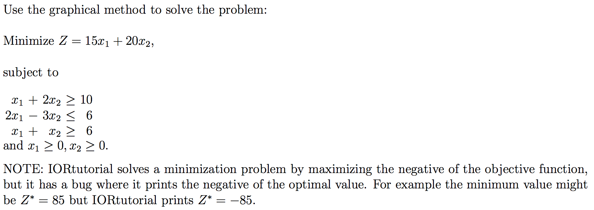
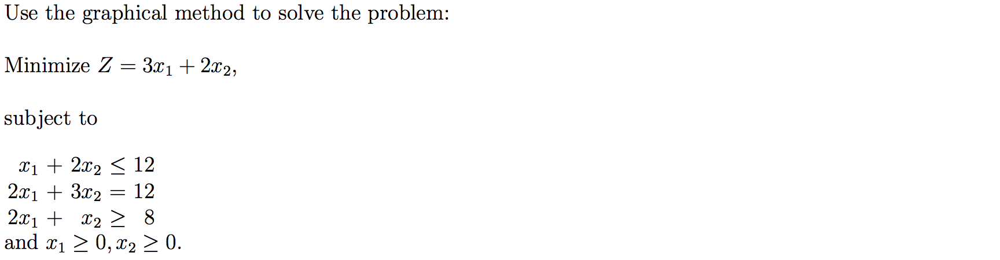
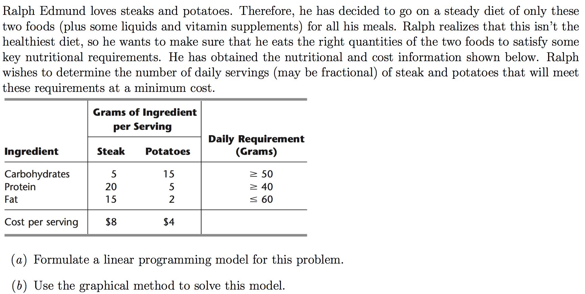
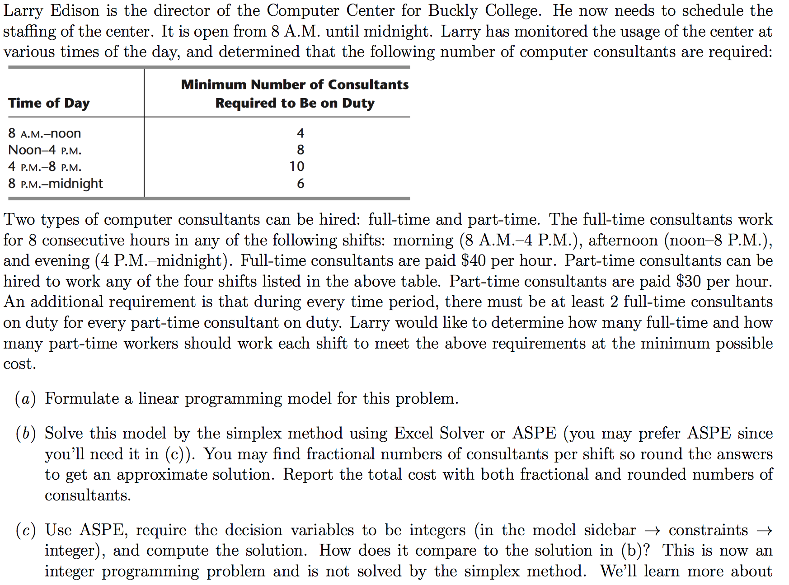
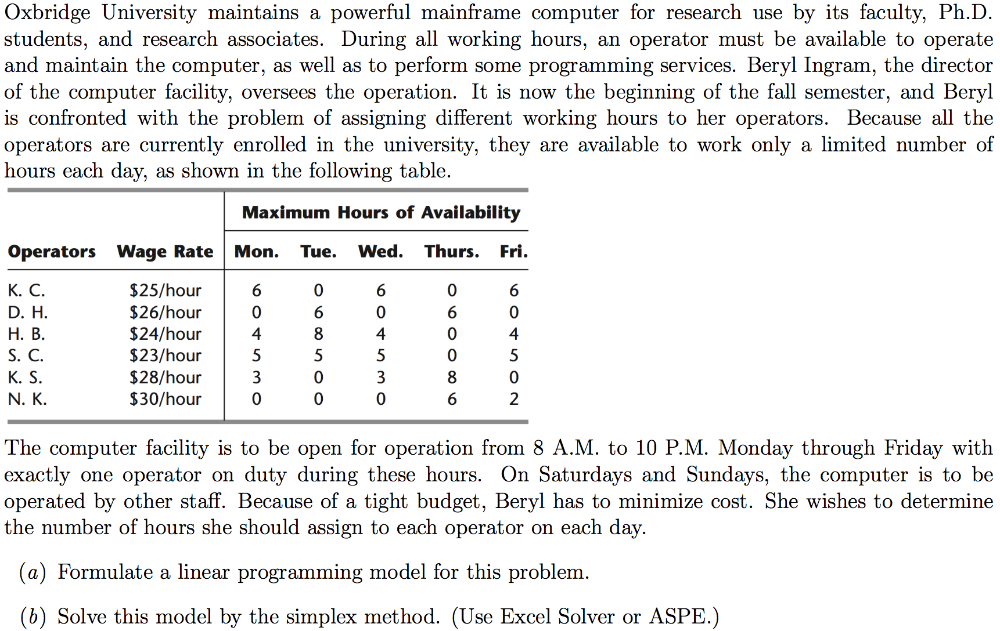
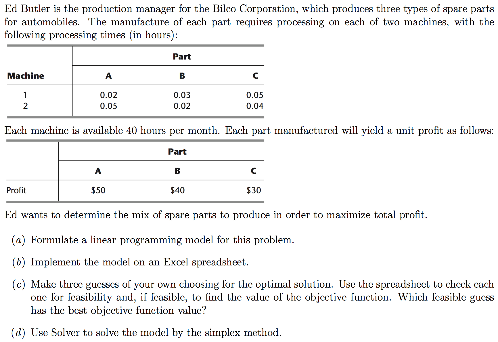
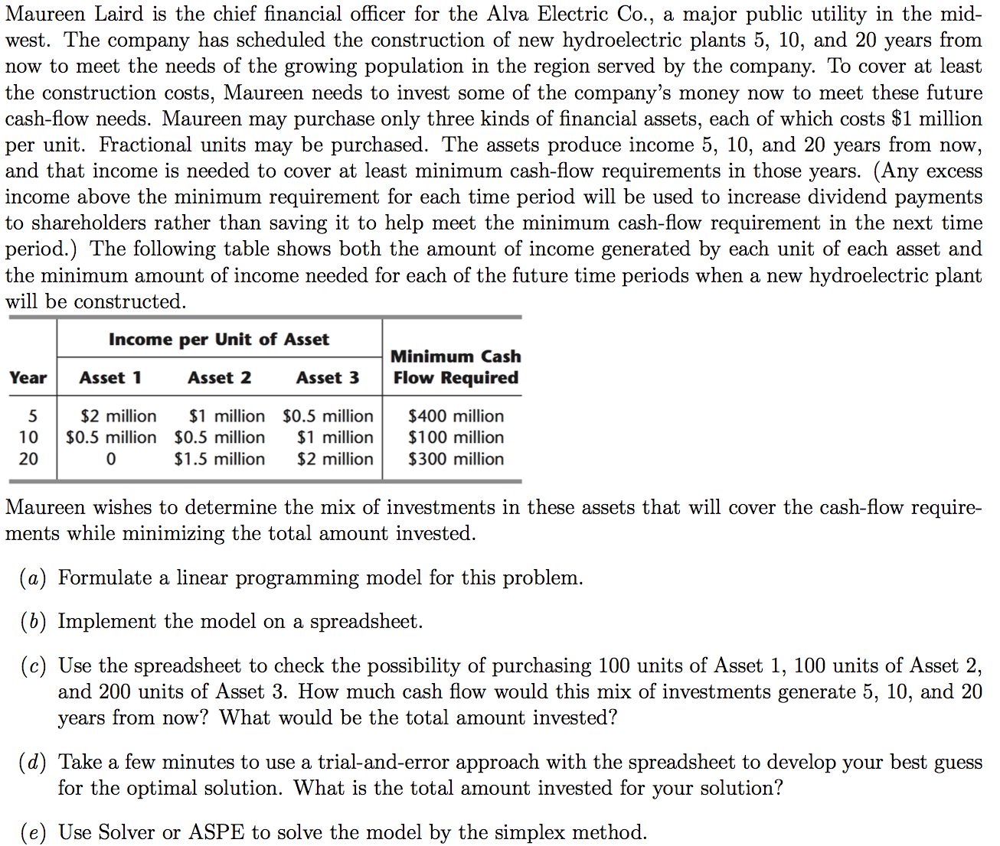

```{r setup, include=FALSE}
knitr::opts_chunk$set(echo = TRUE)
```

## Instructions

Download files at https://github.com/DataScienceUWL/DS775.  The files for this HW are in Homeworks/Lesson02_Download.

Complete the following problems and add your solutions to this word document.  An R markdown file is included if you'd prefer to knit your soulutions. Note that some of the problems have slightly different instructions than those in the text.  For problems that ask you to use IORtutorial or Excel you should include a screenshot or two showing your work.  For problems that ask you to formulate a model you should present the objective function and the constraints like those that are presented in the first problem.  If typing the equations is too tedious simply take a picture of your neatly handwritten equations and include it in the document.  You should be able to refer to this document a few months in the future and be able to see not only the problem, but also enough information that you can recall how you arrived at the solution.  Save the completed document as your reference document.

For problems that say to use the graphical method you can use either IORtutorial (available on the virtual desktop or do a bit of creative googling) or use the online tool at http://www.phpsimplex.com/simplex/simplex.htm?l=en (select Method -> Graphical Method and count the non-negativity constraints in the number of constraints; $x_1 \geq 0$ can be written as $1 x_1 + 0 x_2 \geq 0$).

### Getting Help:  

Post questions on Piazza.  Always include the problem number in your subject line, e.g. "HW 1.3" so that it's easy to search and find relevant posts.  If your post would reveal a significant portion of a solution then make it a private post and tell us if it is OK to share it publically and we can judge whether or not to share it.  

Example Excel files are in the Examples subdirectory of the download folder.

### What to hand in:

* Take your reference document and delete the problem statements (the images) as well as all of the material above the first problem except the title and your name.  Keep the problem numbers / labels.  Submit the cleaned document to the D2L dropbox.
* Clearly name any Excel or other auxilliary files and upload those as well.


## HW 2.1 - Textbook 3.4-4



## HW 2.2 - Textbook 3.4-5



## HW 2.3 - Textbook 3.4-8



## HW 2.4 - Textbook 3.4-10



## HW 2.5 - Textbook 3.4-15



## HW 2.6 - Textbook 3.5-3



## HW 2.7 - Textbook 3.5-6




