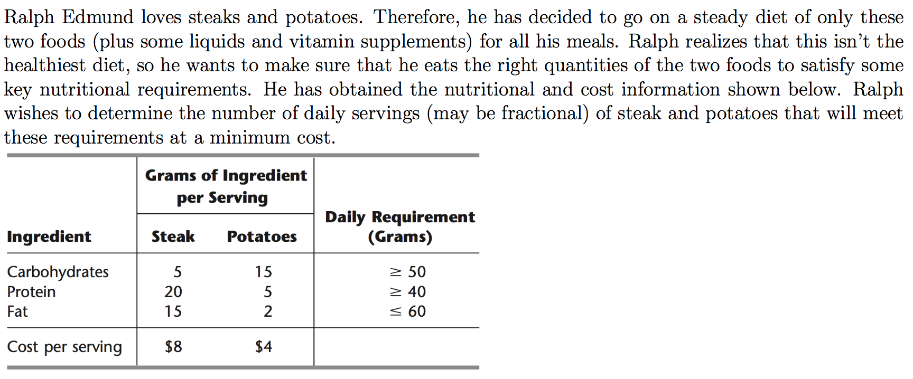
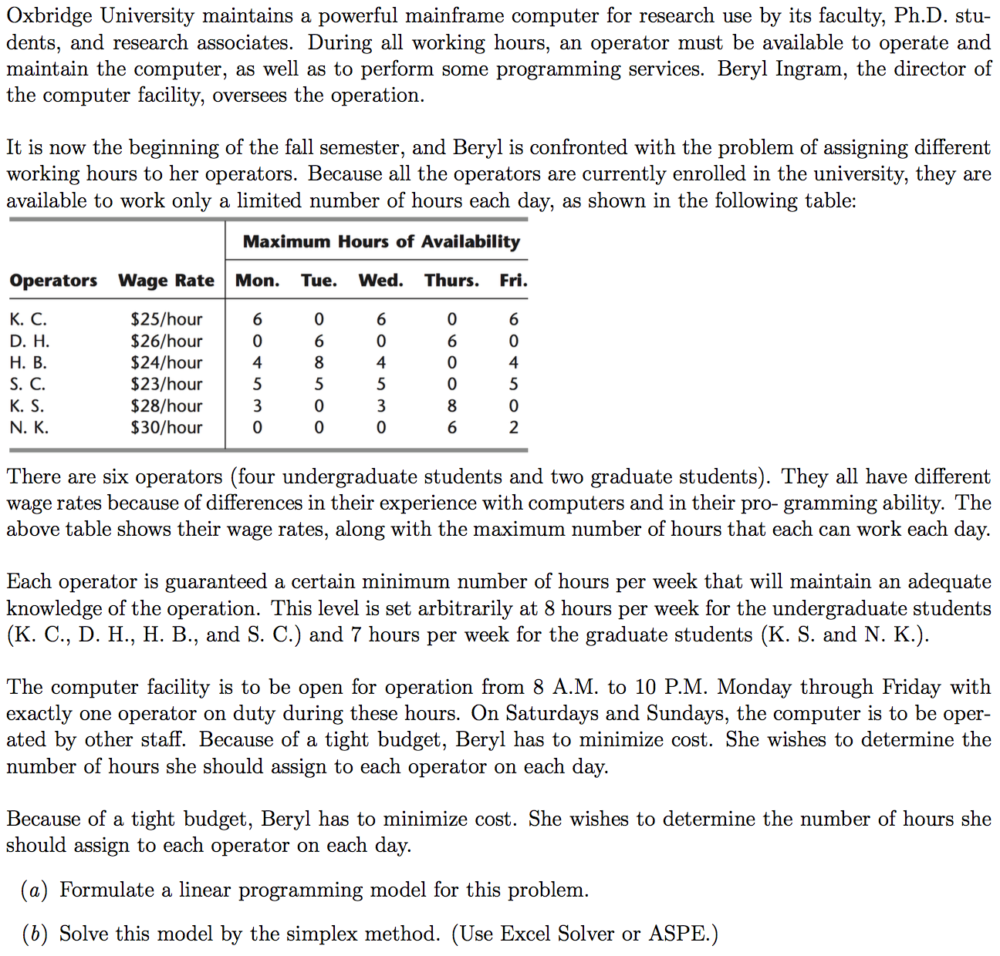

```{r setup, include=FALSE}
knitr::opts_chunk$set(echo = TRUE)
```

## Instructions

Download files at https://github.com/DataScienceUWL/DS775.  The files for this HW are in Homeworks/Lesson03_Download.

Complete the following problems and add your solutions to this word document.  An R markdown file is included if you'd prefer to knit your soulutions.  As in past weeks your submission should be a complete reference document.  You'll be using OPL this week so you can include your OPL code and data and pictures of the OPL solutions in the reference document.  If you knit this document you can easily include your code in code blocks for easy reading.  If you edit the document in word try using a fixed width font for just the code parts to make it easier to read (R markdown uses the `Consolas` font in Word documents for code).

```{r eval = FALSE}
for (i in 1:10){
  i^2
}
```

### Getting Help:  

Post questions on Piazza.  Always include the problem number in your subject line, e.g. "HW 1.3" so that it's easy to search and find relevant posts.  If your post would reveal a significant portion of a solution then make it a private post and tell us if it is OK to share it publically and we can judge whether or not to share it. 

### What to hand in:

* Take your reference document and delete the problem statements (the images) as well as all of the material above the first problem except the title and your name.  Keep the problem numbers / labels.  Submit the cleaned document to the D2L dropbox.
* Clearly name any Excel or other auxilliary files and upload those as well.


## HW 3.1 - Textbook 3.4-8



Solve this three times in OPL. In each case include your model (and data file) as well as the results in your Word document.  The material in the OPL_Language_User's_Manual.pdf on pages 10-16 provides some useful examples.

* First, put together a model that looks almost exactly like the mathematical formulation of the problem (see Solutions for Lesson 2 for instance).  This should be in the style of Wyndor1.mod in the Examples download folder.  Upload 3p1a.mod.
* Second, multiply the third constraint ("Fat") by -1 so that this constraint is now "$\geq$" like the first two.  Use vectors and arrays of coefficients like in Wyndor3.mod to produce a model which can be generalized  (like Slide 9 in the video) more easily than your first one.  We've included a file 3p1b_skeleton.mod that is partly done and some hints for the rest.  Upload 3p1b.mod.
* Third, separate the model and the data (like Slide 14).  This should be in the style of Wyndor4.mod and Wyndor4.dat.  Upload 3p1c.mod, 3p1c.dat


## HW 3.2 - Textbook 3.4-15



Solve this twice in OPL. In each case include your model (and data file) as well as the results in your Word document. The material in the OPL_Language_User's_Manual.pdf on pages 16-19 provides some useful examples of tuples. Additionally the material on pages 28-31 shows two models transp1.mod and transp3.mod that are like the two versions of the model you're being asked to produce here.  

* In the first version your decision variables should be a two-dimensional array of non-negative floats indexed by operators and days of the week.  You'll use an array of constraints to provide an upper bound on the availability for each operator and day combination (this is like the Excel sheet Problem_3.4-15.xlsx from Lesson 2 Solutions). Your model and data should be separated into model and data files.  Upload HW3p2a.mod and HW3p2a.dat.  
*In the second version the decision variables should be a vector of of non-negative floats indexed by tuples.  You'll have one tuple for each worker-day combination for which the worker is available.  You should not have decision variables for for worker-day combinations on which the worker is not available (this is like the Excel sheet Problem_3.4-15_ver2.xlsx from Lesson 2 Solutions).  When you have a large problem in which many of the possible variables are zero (sparsity) it makes sense to have spend the extra effort (like with tuples) to reduce the number of decision variables to reduce the compuational and memory requirements.  Again your model and data should be separated model and data files.  Upload HW3p2b.mod and HW3p2b.dat.


