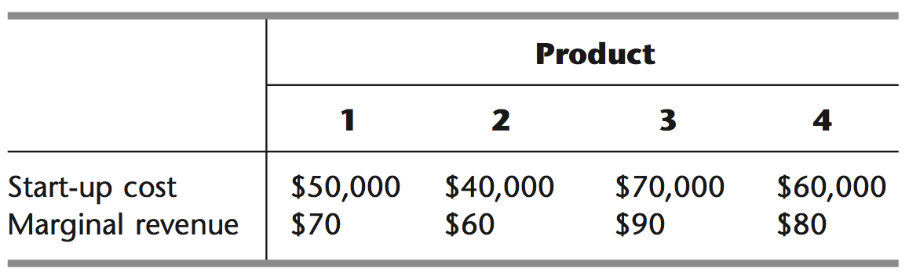

```{r setup, include=FALSE}
knitr::opts_chunk$set(echo = TRUE)
```

## Instructions

Download files at https://github.com/DataScienceUWL/DS775.  The files for this HW are in Homeworks/Lesson04_Download.

Complete the following problems and add your solutions to this word document.  An R markdown file is included if you'd prefer to knit your soulutions.  As in past weeks your submission should be a complete reference document.  The tools this week are a mixture of Excel, OPL, and R.  Include source code and screenshots to make this a complete reference document.  If you knit this document you can easily include your code in code blocks for easy reading.  If you edit the document in word try using a fixed width font for just the code parts to make it easier to read (R markdown uses the `Consolas` font in Word documents for code).

### Getting Help:  

Post questions on Piazza.  Always include the problem number in your subject line, e.g. "HW 1.3" so that it's easy to search and find relevant posts.  If your post would reveal a significant portion of a solution then make it a private post and tell us if it is OK to share it publically and we can judge whether or not to share it. 

### What to hand in:

* Take your reference document and delete the problem statements (text and images) as well as all of the material above the first problem except the title and your name.  Keep the problem numbers / labels.  Submit the cleaned document to the D2L dropbox.
* Clearly name any OPL, Excel, or R files and upload those as well.


## HW 4.1 (14 pts)

This problem involves building a transportation model.  Instead of having suppliers ship directly to customers, this problem has factories that ship to warehouses and warehouses that ship to stores.  (Think Walmart distribution centers).  There are different per unit costs associated with shipping between factories and warehouses and also between warehouses and stores.  Your job is to minimize the total shipping costs subject to the following constraints

a.	The total supply of each product is the same as the total demand
b.	The total over all products that may be shipped along a route is constrained by CapacityFW (from Factories to Warehouses) and Capacity WS (from Warehouses to Stores)
c.	The total number of all products that may be stored in a Warehouse is limited by MaxStorage
d.	For each product and for each warehouse the total product shipped from Factories to that Warehouse is the same as the total product shipped from that Warehouse to stores.
e.	For each product, the Supply at the Factories and the Demand at the Stores is specified. 

You’ll want to attack this problem in steps:  

* Step1: You’ll need to write an R script that reads the spreadsheet and produces an appropriate .dat file.  As an example, the transpWrite.R script in the weekly download folder reads the transpsheet.xlsx file and produces the transp4new.dat file.  You’ll need to produce your own script that reads an excel spreadsheet and produces a data file for the Factory to Store problem.  You can test your script by seeing if you can read transpStoreSheet.xlsx and produce transpStore.dat (extra spaces don’t matter, but you’ll otherwise need to match).  Finally, use your script to read transpStoreBigSheet.xlsx and produce a data file (you can rename it later).  You’ll have to modify the script a bit because the larger spreadsheet layout isn’t exactly the same as that of the validation spreadsheet.  *Feel free to use any R package to read the Excel.  It's also OK to use Python for this step if you'd prefer it.*
*	Step 2: Now you need to build the model.  A “skeleton” model file is provided in the download folder: transpStore-Skeleton.mod.  You can also study the transp4.mod file from the example last week.  You can test your model by running it with the transpStore.dat file.  If you’ve done everything correctly you should see this output 

```{eval = FALSE}
// solution (optimal) with objective 54800
Transport Amounts FW:
 pA:fA->wA 300
 pA:fA->wB 0
 pA:fA->wC 0
 pA:fB->wA 0
 pA:fB->wB 0
 pA:fB->wC 200
 pA:fC->wA 0
 pA:fC->wB 400
 pA:fC->wC 0
 pA:fD->wA 0
 pA:fD->wB 0
 pA:fD->wC 100
 pB:fA->wA 300
 pB:fA->wB 0
 pB:fA->wC 0
 pB:fB->wA 0
 pB:fB->wB 0
 pB:fB->wC 100
 pB:fC->wA 0
 pB:fC->wB 200
 pB:fC->wC 0
 pB:fD->wA 100
 pB:fD->wB 0
 pB:fD->wC 300

Storage in Warehouse:
wA : 700
wB : 600
wC : 700
```

* Step 3: Now run the model on the data file you produced in Step 1 and report the results.  Include the .R script you made in Step 1, the model from Step 2, and the output from the scripting output window in OPL.  Upload these files in addition to this document.  Do not include the .dat file in this document, but do upload it.


## HW 4.2 - Textbook 12.4-2 (8 pts)

Reconsider the Wyndor problem presented in Chapter 3 (how many doors? how many windows?  Maximize profit. page 28 in the textbook.) Here is the model from that problem:

Maximize $Z = 3x_1 + 5 x_2$

Subject to:

$x_1 \leq 4$

$2x_2 \leq 12$

$3x_1 + 2x_2 \leq 18$

$x_1 \geq 0, x_2 \geq 0$

Where $x_1$ is the batches of doors, $x_2$ is the batches of windows, and $Z$ is profit.

Management now has decided that only one of the two new products should be produced, and the choice is to be made on the basis of maximizing profit.

a. Introduce *auxiliary binary variables* to formulate an MIP model for this new version of the problem.  Write the model here.
b. Solve the problem in Excel and document it here. You can start with Wyndor Glass.xlsx, included in the download this week, and modify it if you like. Upload your final Excel file.


## HW 4.3 - Textbook 12.3-1 (8 pts)

The Research and Development Division of the Progressive Company has been developing four possible new product lines. Management must now make a decision as to which of these four products actually will be produced and at what levels. Therefore, an operations research study has been requested to find the most profitable product mix.

A substantial cost is associated with beginning the production of any product, as given in the first row of the following table. Management’s objective is to find the product mix that maximizes the total profit (total net revenue minus start-up costs).

 

Let the continuous decision variables $x_1, x_2, x_3,$ and $x_4$ be the production levels of products 1, 2, 3, and 4, respectively. Management has imposed the following policy constraints on these variables:

1. No more than two of the products can be produced.
2. Either product 3 or 4 can be produced only if either product 1
or 2 is produced.
3. Either $5x_1 + 3x_2  + 6x_3 +  4x_4  \leq 6000$
or $4x_1  + 6x_2 + 3x_3 + 5x_4  \leq 6000$.

(a) Introduce auxiliary binary variables to formulate a mixed BIP model for this problem. Write the model here.

(b) Use OPL to solve this model. You can keep this model simple and include everything in the .mod file if you like.  Include the model here as well as the solution (type it or screenshot).  Upload the model also.