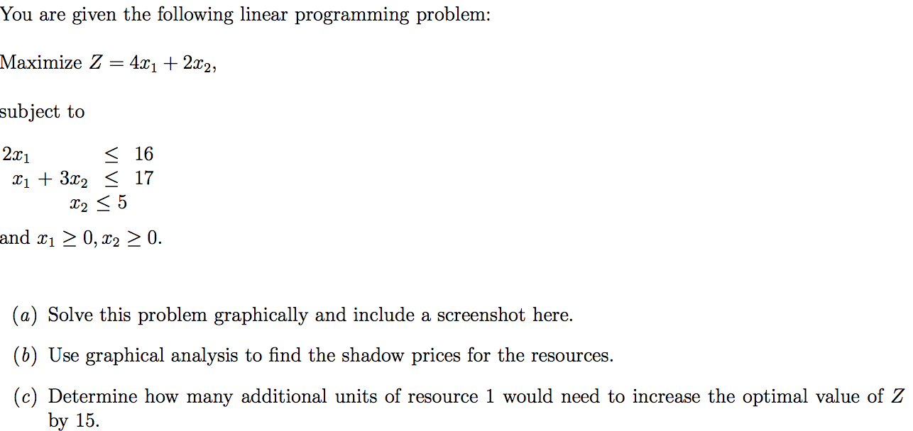
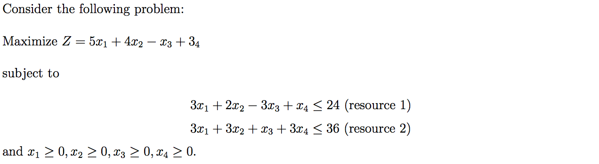
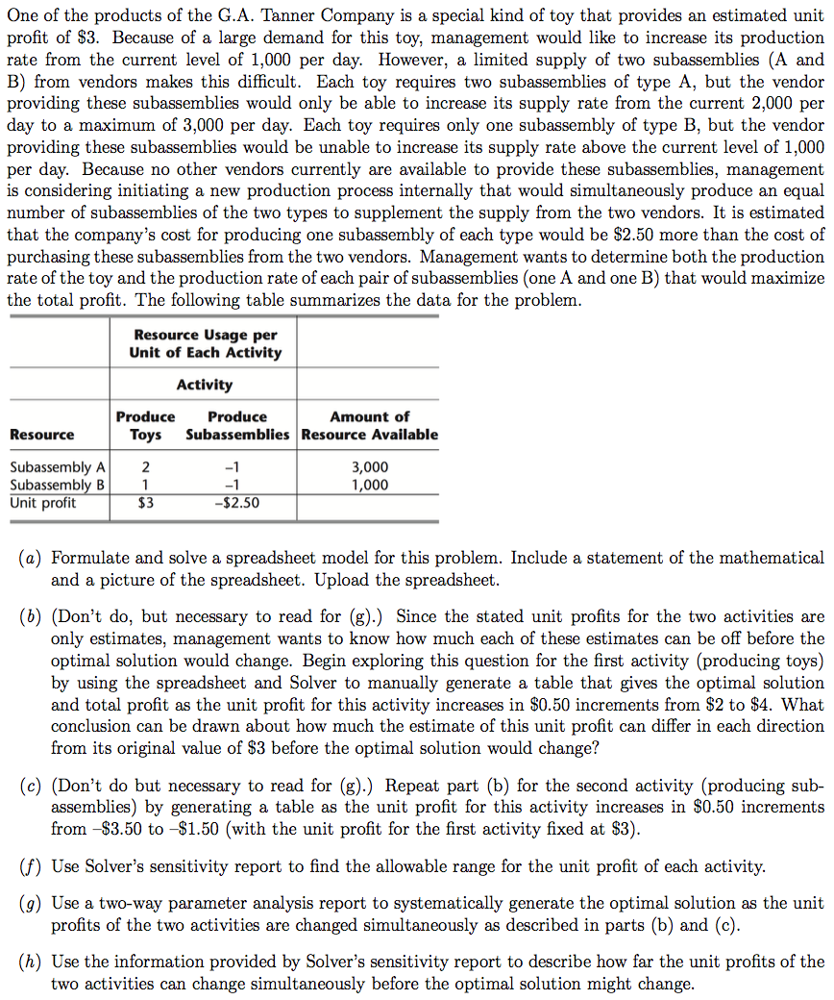
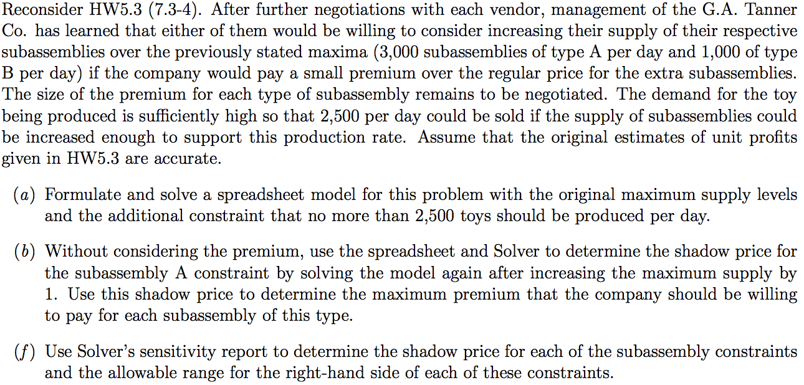
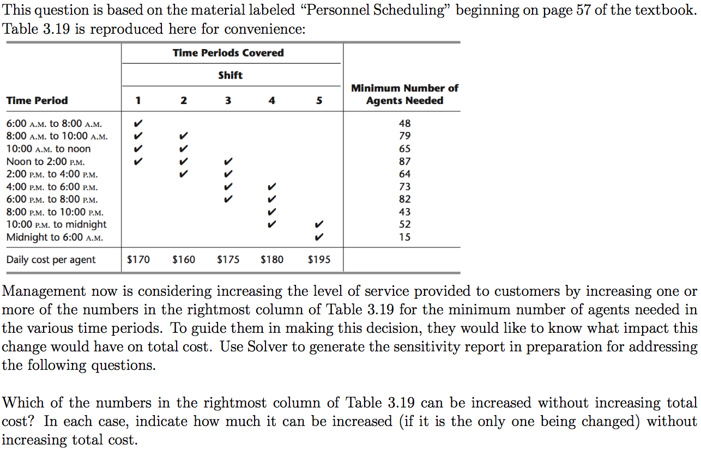
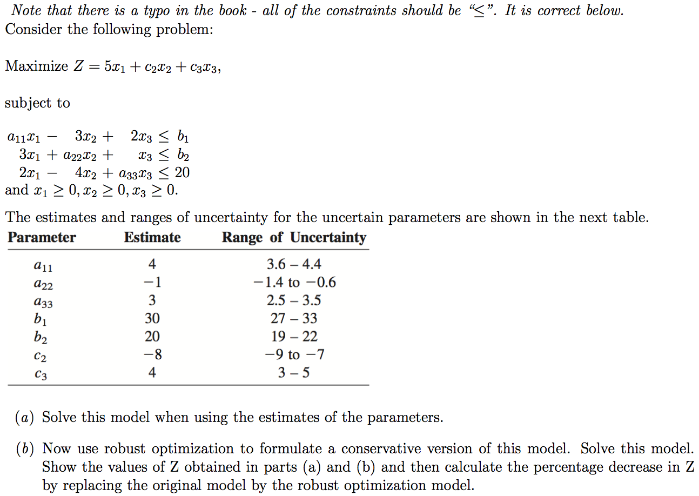
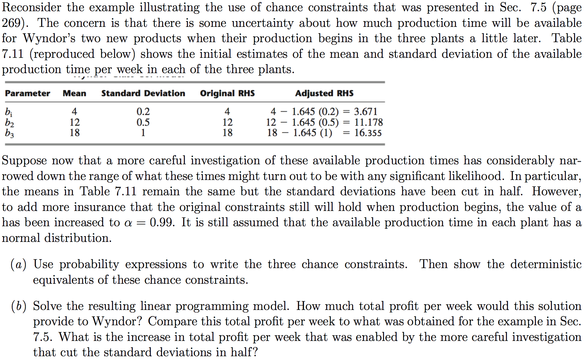
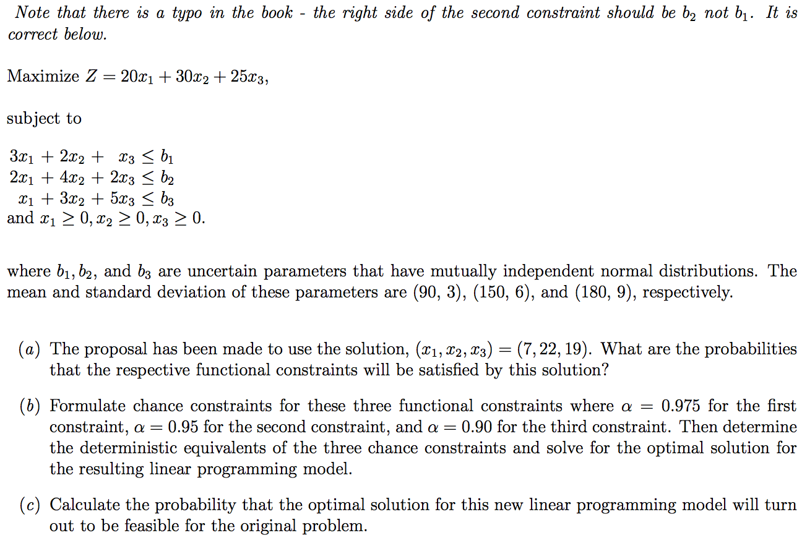
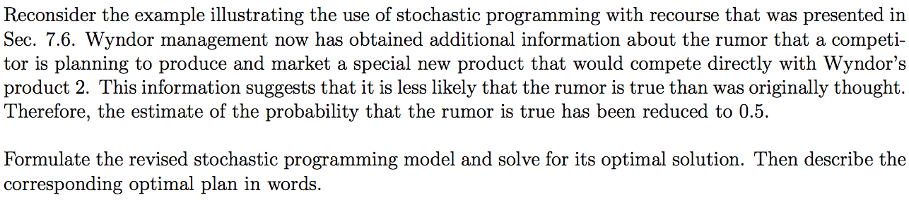

```{r setup, include=FALSE}
knitr::opts_chunk$set(echo = TRUE)
```

## Instructions

Download files at https://github.com/DataScienceUWL/DS775.  The files for this HW are in Homeworks/Lesson05_Download.

Complete the following problems and add your solutions to this word document.  An R markdown file is included if you'd prefer to knit your soulutions.  As in past weeks your submission should be a complete reference document.  The tools this week are a mixture of Excel, OPL, and R.  Include source code and screenshots to make this a complete reference document.  If you knit this document you can easily include your code in code blocks for easy reading.  If you edit the document in word try using a fixed width font for just the code parts to make it easier to read (R markdown uses the `Consolas` font in Word documents for code).

### Getting Help:  

Post questions on Piazza.  Always include the problem number in your subject line, e.g. "HW 1.3" so that it's easy to search and find relevant posts.  If your post would reveal a significant portion of a solution then make it a private post and tell us if it is OK to share it publically and we can judge whether or not to share it. 

### What to hand in:

* Take your reference document and delete the problem statements (text and images) as well as all of the material above the first problem except the title and your name.  Keep the problem numbers / labels.  Submit the cleaned document to the D2L dropbox.
* Clearly name any OPL, Excel, or R files and upload those as well.

## HW 5

*The problems this week are pretty much straight out of the
  textbook except that we don't always ask you to do all parts of the
  problem.  The problems are reproduced here for convenience, but
  several of these problems refer to material in the text which was
  too lengthy to reproduce here.*

## HW 5.1 - Textbook 4.7-3 (for the graphing part use IOR tutorial, desmos, graph by hand and take a picture, etc)

 

## HW 5.2 - Textbook 4.7-6(c)

 

## HW 5.3 - Textbook 7.3-4 (a, f, g, h)

 

## HW 5.4 - Textbook 7.3-5 (a, b, f)

 

## HW 5.5 - Textbook 7.3-7 (a)

 

## HW 5.6 - Textbook 7.4-4

 

## HW 5.7 - Textbook 7.5-1 

 

## HW 5.8 - Textbook 7.5-4

 


## HW 5.9 - Textbook 7.6-1

 

## HW 5.10 - Textbook 7.6-3

 