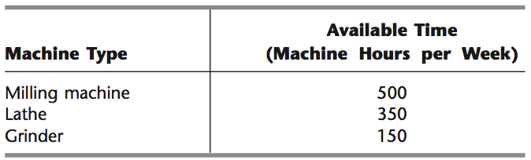
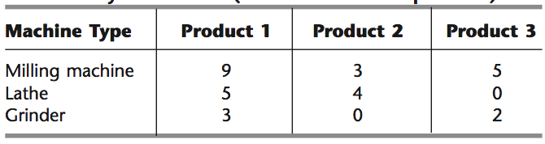

```{r setup, include=FALSE}
knitr::opts_chunk$set(echo = TRUE)
```

## Instructions

Download files at https://github.com/DataScienceUWL/DS775.  The files for this HW are in Homeworks/Lesson08_Download.

Complete the following problems and add your solutions to this word document.  An R markdown file is included if you'd prefer to knit your soulutions.  As in past weeks your submission should be a complete reference document.  The tools this week are a mixture of Excel and OPL.  Include source code and screenshots to make this a complete reference document.  If you knit this document you can easily include your code in code blocks for easy reading.  If you edit the document in word try using a fixed width font for just the code parts to make it easier to read (R markdown uses the `Consolas` font in Word documents for code).

**Python.**  If you'd like to explore using Python to solve any of these pr oblems instead of OPL or Excel that's fine (in fact I'd like it since I'm planning to include python in the next iteration of this course).  Include your source code and output in this document and upload the corresponding .py or .ipynb file to the dropbox.  If you decide to do the entire assignment in Python, feel free to submit a Jupyter notebook.

### Getting Help:  

Post questions on Piazza.  Always include the problem number in your subject line, e.g. "HW 1.3" so that it's easy to search and find relevant posts.  If your post would reveal a significant portion of a solution then make it a private post and tell us if it is OK to share it publically and we can judge whether or not to share it. 

### What to hand in:

* Take your reference document and delete the problem statements (text and images) as well as all of the material above the first problem except the title and your name.  Keep the problem numbers / labels.  Submit the cleaned document to the D2L dropbox.
* Your final submission must contain complete solutions, not just final answers.  This means you need to include source code, spreadsheet screenshots, etc. so that we see not only your answer, but also you got that answer.
* Clearly name any OPL, Excel, or Python files and upload those as well.

## HW 8 (problems are 6 points each)

### HW 8.1 - Textbook 13-7.2

Consider the following quadratic programming problem:

Maximize $f(x_1, x_2) = 8x_1 - x_1^2 + 4x_2 - x_2^2,$

subject to $x_1 + x_2 \leq 2, x_1 \geq 0, x_2 \geq 0.$

Use ASPE to solve 13-7.2.  Include a picture of the spreadsheet here.  Upload hw8p1.xslx

### HW 8.2 - Textbook 13-7.6

A stockbroker, Richard Smith, has just received a call from his most important client, Ann Hardy. Ann has $50,000 to invest and wants to use it to purchase two stocks. Stock 1 is a solid blue-chip security with a respectable growth potential and little risk involved. Stock 2 is much more speculative. It is being touted in two investment newsletters as having outstanding growth potential but also is considered very risky. Ann would like a large return on her investment but also has considerable aversion to risk. Therefore, she has instructed Richard to analyze what mix of investments in the two stocks would be appropriate for her.

Ann is used to talking in units of thousands of dollars and 1,000-share blocks of stocks. Using these units, the price per block is 20 for stock 1 and 30 for stock 2. After doing some research, Richard has made the following estimates. The expected return per block is 5 for stock 1 and 10 for stock 2. The variance of the return on each block is 4 for stock 1 and 100 for stock 2. The covariance of the return on one block each of the two stocks is 5.

The equations for portfolio analysis are on page 551.  The summation notation makes the equations a bit cumbersome so here they are written out as they apply to this problem.  Let $x_1$ and $x_2$ be blocks of stock 1 and stock 2, respectively.  The problem becomes

Minimize $V(x_1,x_2) = \sigma_{11} x_1^2 + \sigma_{12} x_1 x_2 + \sigma_{21} x_2 x_1 + \sigma_{22} x_2^2,$

Subject to $\mu_1 x_1 + \mu_2 x_2 \geq L, P_1 x_1 + P_2 x_2 \leq B, x_1 \geq 0, x_2 \geq 0.$

(a)  Write out the complete nonlinear programming model filling in the constants but leaving $L$ unspecified for now.

(b) Use Solver with its GRG Nonlinear solving method or ASPE with its Quadratic solving method to solve this model for four cases:  minimum acceptable expected return $ = 13, 14, 15, 16.$  Report the $(x_1^*, x_2^*, V^*)$ for each case.  Include a picture of the spreadsheet.  Upload hw8p2.xlsx.

### HW 8.3 - Textbook 13.7-7

The management of the Albert Hanson Company is trying to determine the best product mix for two new products. Because these products would share the same production facilities, the total number of units produced of the two products combined cannot exceed two per hour. Because of uncertainty about how well these products will sell, the profit from producing each product provides decreasing marginal returns as the production rate is increased. In particular, with a production rate of $R_1$ units per hour, it is estimated that Product 1 would provide a profit (in dollars per hour) of $200 R_1 - 100 R_1^2.$ If the production rate of product 2 is $R_2$ units per hour, its estimated profit (in dollars per hour) would be $300 R_2 - 100 R_2^2.$  

(a) Formulate a quadratic programming model in algebraic form for determining the product mix that maximizes the total profit per hour.  We are allowing fractional solutions here so this is not an integer programming problem.

(b) Use OPL to solve the quadratic program. A sample OPL quadratic program, qpex1.mod, is included in the download packet. Include the source code for the model file in this document as well as a screenshot of the problem browswer showing the solution.  Upload hw8p3.mod.

### HW 8.4 - Textbook 13.10-5

Consider the following nonconvex programming problem:

Maximize Profit $=100 x^6 - 1359 x^5 + 6836 x^4 - 15670 x^3 + 15870 x^2 - 5095 x$

subject to $0 \leq x \leq 5.$

(a) Make a graph of this function and include a screen shot.  I like the online graphing calculator at desmos.com - use the "wrench" icon to access settings to adjust the graphing window.  How many local maxima are there.  From the graph approximate the maximum profit and where does it occurs.

We are going to learn more about multistart and evolutionary algorithms in Lesson 9 so consider this a warmup problem.

(b) Use Solver with the GRG Nonlinear solving method with the Multistart option to solve this problem.  Include a picture here.  Upload hw8p4.xlsx.

(c) Use Solve with the Evolutionary Solver method to solve this problem.  Include this approach in an additional sheet in hw8p4.xlsx.  Include a picture here.

(d) What differences, if any, did you observe between the two solving approaches?

### HW 8.5 - Textbook 13.1-2

The Omega Manufacturing Company has discontinued the production of a certain unprofitable product line. This act created considerable excess production capacity. Management is considering devoting this excess capacity to one or more of three products; call them products 1, 2, and 3. The available capacity on the machines that might limit output is summarized in the following table:

 

The number of machine hours required for each unit of the respective products is (in machine hours per unit):

 


The sales department indicates that the sales potential for products 1 and 2 exceeds the maximum production rate and that the sales potential for product 3 is 20 units per week.  The unit costs for producing products 1, 2, and 3 are \$25, \$10, and \$15, respectively.  The firm encounters price elasticity in selling the three products so that the prices required (in dollars) in order to be able to sell $x_1$ , $x_2$ , and $x_3$ units are 
$(35 + 100 x_1^{-\frac{1}{3}} )$, $(15 + 40x_2^{-\frac{1}{4}})$, and $(20 + 50 x_3^{-\frac{1}{2}}),$ respectively.

(a) State a nonlinear programming model for the problem of determining how many units of each product the firm should produce to maximize profit.

(b) Solve using the GRG Solver in ASPE.  Note, you'll need to algebraically simplify the objective function to avoid division by zero errors.  This is an example of a convex objective function, but proving that is beyond our scope.  Include a picture of the spreadsheet and upload hw8p5.xlsx.


